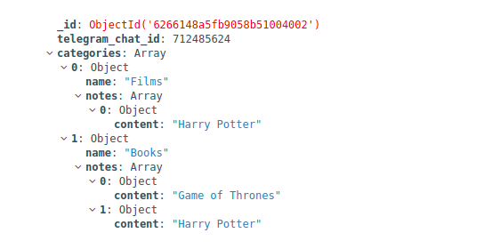

# ArthurNotesBot

[](https://goreportcard.com/report/github.com/arthurshafikov/tg-notebot)


So instead of talking a lot let me just show you demo of this noteBot:


This is a simple bot for storing your notes. For example, if you hear about some interesting film, and you are afraid that you'll forget about it, you can just open your Telegram and save your note using this bot.
It's not convenient to use your phone's notes, and it's not convenient to text name of these films/books in your chat with yourself. 

This was my problem and this is how I found a solution to it. Now I can easily store anything that I need to memorize in 2 actions: open the Telegram on my phone and send a note to this bot.

Under the hood, this project has MongoDB. This database has only one collection - *users*. User's categories and notes are stored inside of his document.


# Commands

## Docker-compose

Run the application
```
make up
```

Down the application
```
make down
```

---
## Tests

Run unit tests
```
make test
```
